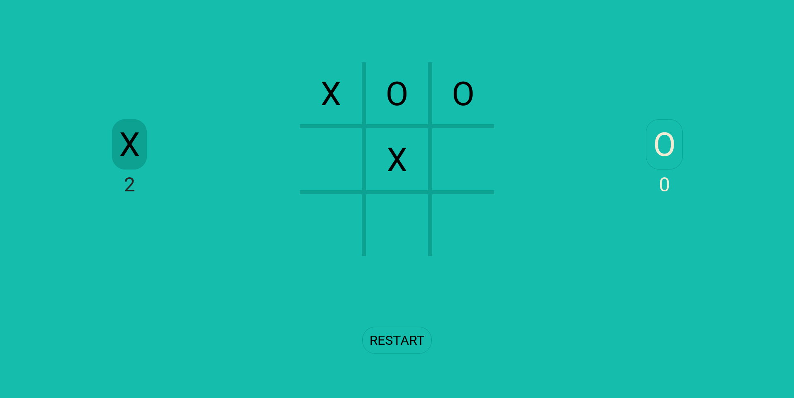

# The Odin Project - Tic Tac Toe Project

This is a solution to the [Tic Tac Toe Project on The Odin Project](https://www.theodinproject.com/lessons/node-path-javascript-tic-tac-toe). The Odin project is a website that offers high quality coding education created by an Open-Source community.

## Table of contents

- [Overview](#overview)
  - [The challenge](#the-challenge)
  - [Screenshot](#screenshot)
  - [Links](#links)
- [My process](#my-process)
  - [Built with](#built-with)
  - [What I learned](#what-i-learned)
  - [Continued development](#continued-development)
  - [Useful resources](#useful-resources)
- [Author](#author)

## Overview

### The challenge

Users should be able to:

- Create a tic-tac-toe game playable in the browser
- Use modules and factory functions for the project

### Screenshot

### Links

- Solution URL: [https://github.com/wmartyr/top-tic-tac-toe](https://github.com/wmartyr/top-tic-tac-toe)
- Live Site URL: [https://wmartyr.github.io/top-tic-tac-toe/](https://wmartyr.github.io/top-tic-tac-toe/)

## My process

### Built with

- Semantic HTML5 markup
- CSS custom properties
- CSS Grid
- Vanilla Javascript

### What I learned

I learned a lot about factory functions, modules, and callbacks. I also learned how to use modals to make pop up windows. This is the most complex javascript I've done so far in my journey and it is great practice for me.

### Continued development

The computer moves is really dumb as I just used a random number generator to make random choices. I have an idea on how this can be improved. I might revisit this in the future and try to improve it.

### Useful resources

- [https://www.w3schools.com/howto/howto_css_modals.asp](https://www.w3schools.com/howto/howto_css_modals.asp) - This helped me to create the popup windows.
- [www.google.com](www.google.com) - I just copied the colors of the tic tac toe game that comes up when you google it. I just thought there is no need to overthink it as the goal of this module is javascript.

## Author

- Github - [Woodrow Martyr](https://github.com/wmartyr)